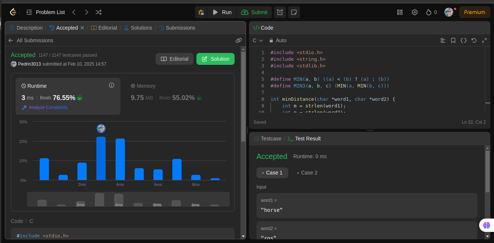

# Programacao_Dinamica_questoesLeetCoded

**Número da Lista**: 53 
**Conteúdo da Disciplina**: PROGRAMAÇÃO DINÂMICA 

## Alunos
|Matrícula | Aluno |
| -- | -- |
| 22/1008688  |  Pedro Paulo Santos Almeida |
| 18/0108875  |  Rodrigo Mattos de Figueiredo Ayres Bezerra |

## Sobre 
O nosso é um projeto de questões do juíz online leetCode, que é um ambiente onde fornece questões de diversos tipos como do mais fácil ao mais difícil para uma boa compreensão sobre os gráfos. Todas as questões estão disṕníveis para qualquer pessoa que deseja ver. 

## Screenshots

**Questão 188**

**Questão 72**

**Questão 132**

**Questão 920**

## Instalação 
**Linguagens**: 
- C 
- Python 

## Uso 
Para usar, deve-se entrar no site do [leetCode](https://leetcode.com/), pesquisar a questão na aba de perguntas e copiar a solução indicada e testar no local apropriado no site.

## Vídeo 

- [Entrega 5 - Parte 1]()
- [Entrega 5 - Parte 2]()

## Outros 
| N° Questão | Descrição questão | Dificuldade |
| --- | ------- | ---------- |
| 188 | [Best Time to Buy and Sell Stock IV](https://leetcode.com/problems/best-time-to-buy-and-sell-stock-iv/description/) | Hard |
| 72 | [Edit Distance](https://leetcode.com/problems/edit-distance/description/) | Medium |
| 132 | [Palindrome Partitioning II](https://leetcode.com/problems/palindrome-partitioning-ii/description/) | Hard |
| 920 | [Number of Music Playlists](https://leetcode.com/problems/number-of-music-playlists/description/) | Hard |
| |  |  |
|  | |  |
